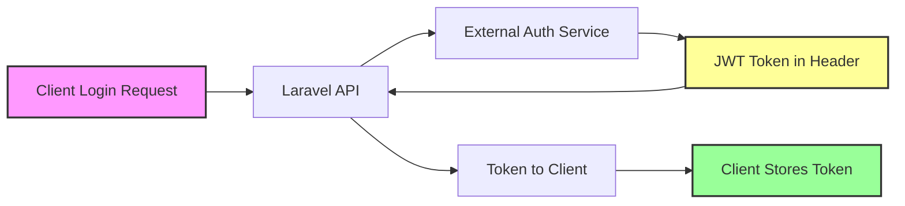

# Database Behavior During Authentication

## Purpose

Explain what **does and does not** get written to the local database during login, and what “stateless JWT” means in this project.

## How to use this project

See [`README.md`](README.md) for setup and login examples.

## How to develop

The login flow lives in:

- `src/app/Services/AuthenticationService.php` (external auth call, user sync)
- `src/app/Repositories/UserRepository.php` (create/update user)

---

## Current Implementation: Stateless JWT + Local User Sync

### What Happens in the Database After Login?

**Short answer:** we do **not** store JWT tokens in the database, but we **do** sync user data into the database during login.

Authentication is still **stateless** in the sense that the API authenticates requests using the **JWT token provided by the external service** (no server-side session token is required), but we also keep a local user record for performance and features.

## Authentication Flow



### Important: JWT Token Location
The external service returns the JWT token in the **response header** (`token` header), not in the response body!

## Step-by-Step Process

### 1. Login Request
```
POST /api/auth/login
{
    "username": "user",
    "password": "pass",
    "device_id": "web"
}
```

### 2. What Laravel Does
- Receives credentials
- Encodes as: `base64(username:password:device_id)`
- Forwards to: `https://testbackerp.teljoy.io/public/login/jwt`
- Returns JWT token to client

### 3. Database Activity
**User sync happens.** On successful login, we attempt to:

- Create/update the user row in `users` (identified by `external_id`)
- Store `last_login_at` and `device_id`

**Tokens are not stored** in the database.

## Current Database Tables

```sql
-- Tables involved in current authentication behavior:
users               -- User profiles synced on login

-- Tables that exist but are not required for JWT validation:
sessions            -- Optional; used for caching permission data (depends on SESSION_DRIVER)
password_reset_tokens -- Password resets (not implemented)
cache               -- Application cache
cache_locks         -- Cache locking mechanism
jobs                -- Queue jobs
failed_jobs         -- Failed queue jobs
job_batches         -- Batch job tracking
migrations          -- Database migration history
```

## What’s Stored vs What’s Not

### Stored

- **User profile data**: synced from external auth response
- **No server sessions**: the API does not rely on `session()` state

### Not stored

- **JWT token**: not persisted in DB (returned to client or stored in HttpOnly cookie)
- **Passwords**: never stored locally

### JWT Token Contains Everything
The JWT token includes:
```json
{
    "sub": "user_id",
    "username": "john_doe",
    "email": "john@example.com",
    "role": "admin",
    "exp": 1234567890,
    "iat": 1234567800
}
```

## What Could Be Stored (Future Enhancements)

If you want to track authentication in the database, consider adding:

### 1. Login Activity Table
```sql
CREATE TABLE login_activities (
    id BIGINT PRIMARY KEY,
    user_id VARCHAR(255),
    ip_address VARCHAR(45),
    user_agent TEXT,
    device_id VARCHAR(255),
    login_at TIMESTAMP,
    logout_at TIMESTAMP NULL,
    token_hash VARCHAR(255)  -- Store hash, not actual token
);
```

### 2. Token Blacklist Table (for logout)
```sql
CREATE TABLE token_blacklist (
    id BIGINT PRIMARY KEY,
    token_hash VARCHAR(255) UNIQUE,
    user_id VARCHAR(255),
    expires_at TIMESTAMP,
    blacklisted_at TIMESTAMP
);
```

### 3. User Sessions Table (for tracking active sessions)
```sql
CREATE TABLE user_sessions (
    id BIGINT PRIMARY KEY,
    user_id VARCHAR(255),
    device_id VARCHAR(255),
    last_activity TIMESTAMP,
    ip_address VARCHAR(45),
    is_active BOOLEAN DEFAULT true
);
```

## How to Implement Database Tracking

### Option 1: Track Login Activity
```php
// In AuthController.php after successful login:
DB::table('login_activities')->insert([
    'user_id' => $decoded_token['sub'],
    'ip_address' => $request->ip(),
    'user_agent' => $request->userAgent(),
    'device_id' => $device_id,
    'login_at' => now(),
    'token_hash' => hash('sha256', $token)
]);
```

### Option 2: Implement Token Blacklisting
```php
// In logout method:
DB::table('token_blacklist')->insert([
    'token_hash' => hash('sha256', $token),
    'user_id' => $user_id,
    'expires_at' => $token_expiry,
    'blacklisted_at' => now()
]);
```

### Option 3: Track Active Sessions
```php
// After login:
DB::table('user_sessions')->insert([
    'user_id' => $user_id,
    'device_id' => $device_id,
    'last_activity' => now(),
    'ip_address' => $request->ip(),
    'is_active' => true
]);
```

## Current vs Enhanced Architecture

### Current (Stateless)
```
Client → Laravel → External Auth → JWT → Client
         (No DB)                    (No DB)
```

### Enhanced (With Tracking)
```
Client → Laravel → External Auth → JWT → Save Activity → Client
                                          ↓
                                       Database
```

## Pros and Cons

### Current Implementation

**Pros:**
- ✅ Fast - No database queries
- ✅ Scalable - No server state
- ✅ Simple - Less code to maintain
- ✅ Secure - Tokens can't be stolen from DB

**Cons:**
- ❌ No audit trail
- ❌ Can't revoke tokens
- ❌ No usage analytics
- ❌ Can't track active sessions

### With Database Tracking

**Pros:**
- ✅ Full audit trail
- ✅ Can revoke tokens
- ✅ Usage analytics
- ✅ Session management
- ✅ Security monitoring

**Cons:**
- ❌ Database overhead
- ❌ More complex
- ❌ Requires cleanup jobs
- ❌ Additional migrations

## Recommendations

### Keep Stateless If:
- Performance is critical
- You don't need audit trails
- External service handles everything
- Simplicity is preferred

### Add Database Tracking If:
- Compliance requires audit logs
- Need to revoke tokens
- Want usage analytics
- Need session management
- Security monitoring is required

## Implementation Commands

If you decide to add database tracking:

```bash
# Create migration for login activities
docker exec laravel_php php artisan make:migration create_login_activities_table

# Create migration for token blacklist
docker exec laravel_php php artisan make:migration create_token_blacklist_table

# Run migrations
docker exec laravel_php php artisan migrate

# Create model
docker exec laravel_php php artisan make:model LoginActivity
```

## Summary

**Current state:** Requests are authenticated using the external JWT token (stateless JWT), while user and permission data are synchronized into the local database to support features and improve performance.

**This is by design** - stateless authentication is often preferred for APIs because it's fast, scalable, and simple. However, if you need tracking, auditing, or token revocation, you'll need to implement database-backed features as shown above.
