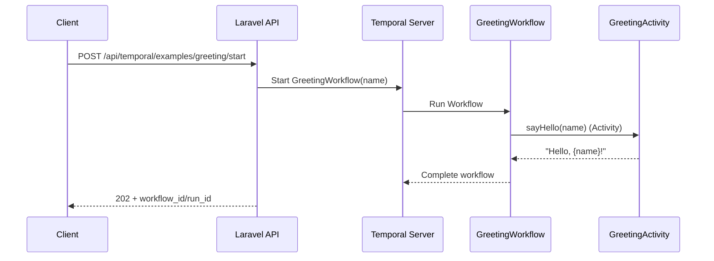
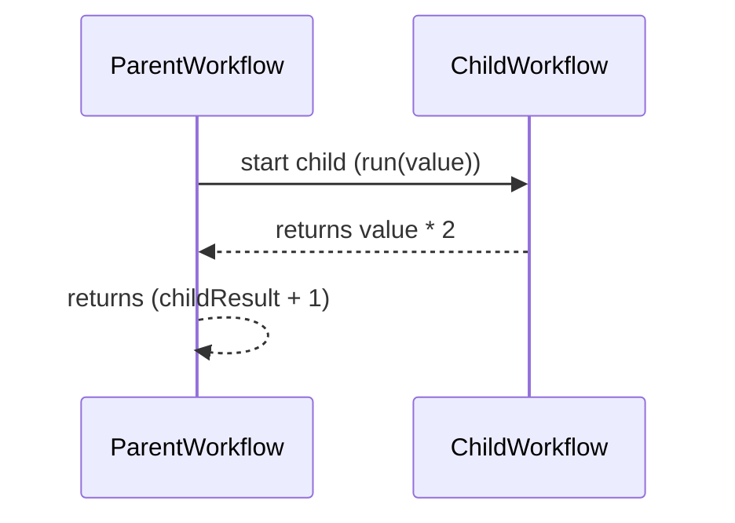

# Temporal Examples Guide (Workflows, Activities, Signals, Queries)

## Purpose

This document explains the **current Temporal examples** in this repo (what happens inside each Workflow, which Activities run, which Signals/Queries exist), and gives a **step-by-step guide to add new examples**.

If you only need to run Temporal locally, start with [`TEMPORAL.md`](TEMPORAL.md).

## Where the code lives

- **Routes**: `src/routes/api.php` (`/api/temporal/examples/*`, JWT-protected)
- **Controller**: `src/app/Http/Controllers/Api/TemporalExamplesController.php`
- **Workflows**: `src/app/Temporal/Workflows/*`
- **Activities**: `src/app/Temporal/Activities/*`
- **Worker entrypoint**: `src/worker.php` (registers Workflow + Activity types)
- **RoadRunner config**: `src/.rr.yaml`
- **Temporal config**: `src/config/temporal.php` (task queue, address, namespace)

## How to run the examples

1. Start the Docker stack (repo root):

```bash
docker-compose up -d --build
```

2. Start the Temporal PHP worker (repo root):

```bash
docker exec -it laravel_php ./vendor/bin/rr serve -c .rr.yaml
```

3. Authenticate (JWT is required for these endpoints):

- Use Postman collection: `Laravel-API-Collection.postman_collection.json`
- Or use your existing PowerShell scripts under `tests/`

## Example 1: Greeting (Workflow + Activity)

### What it demonstrates

- A basic **Workflow → Activity** call with retries.

### Code

- **Workflow**: `App\Temporal\Workflows\GreetingWorkflow` (`GreetingWorkflowInterface`)
- **Activity**: `App\Temporal\Activities\GreetingActivity` (`GreetingActivityInterface`)

### Flow



### Endpoint

- `POST /api/temporal/examples/greeting/start`
- Body:
  - `name` (optional, default: `"world"`)
  - `workflow_id` (optional; if omitted, server generates one)

## Example 2: Order (Signals + Query + Timer + Activity)

### What it demonstrates

- **Signals** to mutate Workflow state:
  - `addItem(item)`
  - `cancel()`
- **Query** to read Workflow state:
  - `status()`
- Deterministic waiting using `Workflow::await()` and `Workflow::timer()`
- An Activity call to “process” the order

### Code

- **Workflow**: `App\Temporal\Workflows\OrderWorkflow` (`OrderWorkflowInterface`)
  - Signals: `addItem`, `cancel`
  - Query: `status`
- **Activity**: `App\Temporal\Activities\OrderActivity` (`OrderActivityInterface`)

### State machine (high level)

- `created` → `waiting_for_items` → (`canceled` OR `cooldown` → `processing` → `completed`)

### Flow

```mermaid
flowchart TD
  S[Start OrderWorkflow(orderId)] --> W[waiting_for_items]
  W -->|Signal addItem| W
  W -->|Signal cancel| C[canceled]
  W -->|await items| T[cooldown (timer 3s)]
  T --> P[processing (Activity process)]
  P --> D[completed]
  Q[Query status] --> W
```

### Endpoints

- **Start**: `POST /api/temporal/examples/order/start`
  - Body:
    - `order_id` (optional)
    - `workflow_id` (optional)
- **Signal add item**: `POST /api/temporal/examples/order/{workflowId}/signal/add-item`
  - Body: `item` (string)
- **Signal cancel**: `POST /api/temporal/examples/order/{workflowId}/signal/cancel`
- **Query status**: `GET /api/temporal/examples/order/{workflowId}/query/status`

### What `status` returns

The query returns a structure like:

- `state`: string (`waiting_for_items`, `cooldown`, `processing`, `completed`, `canceled`)
- `canceled`: boolean
- `items`: list of strings
- `result`: array|null (filled when completed)

## Example 3: Child Workflows (Parent → Child)

### What it demonstrates

- A **parent Workflow** starting a **child Workflow** and waiting for its result.

### Code

- **Parent**: `App\Temporal\Workflows\ParentWorkflow`
- **Child**: `App\Temporal\Workflows\ChildWorkflow`

### Flow



### Endpoint

- `POST /api/temporal/examples/child/start`
- Body:
  - `value` (optional, default: `41`)
  - `workflow_id` (optional)

## Example 4: Activity retries (FlakyActivity)

### What it demonstrates

- Activity retry behavior via `RetryOptions` and the activity attempt count.

### Code

- **Workflow**: `App\Temporal\Workflows\RetryWorkflow`
- **Activity**: `App\Temporal\Activities\FlakyActivity`
  - Throws until `Activity::getInfo()->attempt >= succeedOnAttempt`

### Endpoint

- `POST /api/temporal/examples/retry/start`
- Body:
  - `succeed_on_attempt` (optional, default: `3`)
  - `workflow_id` (optional)

## Example 5: Continue-As-New (history control)

### What it demonstrates

- Splitting long-running/history-heavy workflows using `Workflow::continueAsNew(...)`
- Deterministic waiting using `Workflow::timer(...)` (no `sleep()`)

### Code

- **Workflow**: `App\Temporal\Workflows\ContinueAsNewWorkflow`

### Endpoint

- `POST /api/temporal/examples/continue-as-new/start`
- Body:
  - `items` (optional, default: `[1..10]`)
  - `batch_size` (optional, default: `5`)
  - `workflow_id` (optional)

## Example 6: Saga / compensations (PaymentActivity)

### What it demonstrates

- A basic **Saga pattern**: register compensations while doing forward steps
- On failure, compensations run in reverse order using `Workflow::asyncDetached(...)`

### Code

- **Workflow**: `App\Temporal\Workflows\SagaWorkflow`
- **Activity**: `App\Temporal\Activities\PaymentActivity`
  - Forward steps: `reserveFunds()`, `createShipment()`
  - Compensations: `releaseFunds()`, `cancelShipment()`

### Important behavior

This example intentionally fails when `amount_cents < 100` to demonstrate compensations.

### Endpoint

- `POST /api/temporal/examples/saga/start`
- Body:
  - `order_id` (optional)
  - `amount_cents` (optional, default: `50`)
  - `workflow_id` (optional)

## Example 7: Payment status monitor (ERP Payment API via Activity)

### What it demonstrates

- Calling a real HTTP-backed service (**ERP `/payment/check-status`**) via an **Activity** (Workflow stays deterministic)
- Deterministic polling using `Workflow::timer(...)`
- A **Signal** to “wake up” the Workflow when a webhook is received
- A **Query** to observe progress/state

### Code

- **Workflow**: `App\Temporal\Workflows\PaymentStatusMonitorWorkflow` (`PaymentStatusMonitorWorkflowInterface`)
  - Signal: `webhookReceived(payload)`
  - Query: `status()`
- **Activity**: `App\Temporal\Activities\ErpPaymentActivity` (`ErpPaymentActivityInterface`)
  - Calls Laravel `ErpService->paymentCheckStatus(...)` which calls ERP `/payment/check-status`

### Flow (high level)

```mermaid
flowchart TD
  S[Start PaymentStatusMonitorWorkflow(paymentUuid)] --> W[waiting (timer poll)]
  W --> P[poll check-status (Activity)]
  P -->|terminal status| D[completed]
  P -->|non-terminal| W
  H[Signal webhookReceived] --> P
  Q[Query status] --> W
```

### Endpoints

- **Start**: `POST /api/temporal/examples/payment-monitor/start`
  - Body:
    - `payment_uuid` (required)
    - `poll_seconds` (optional, default: `10`)
    - `max_attempts` (optional, default: `30`)
    - `workflow_id` (optional)
- **Signal (webhook received)**: `POST /api/temporal/examples/payment-monitor/{workflowId}/signal/webhook`
  - Body: any JSON payload (stored for observability; the workflow then verifies via Activity)
- **Query status**: `GET /api/temporal/examples/payment-monitor/{workflowId}/query/status`

### Notes

- Upstream `/payment/*` may be blocked by reverse proxy rules in some deployments; in that case the Activity will fail and the workflow will be retried/failed depending on your retry settings.

## How to add a new Temporal example

### 1) Create a Workflow interface + implementation

- Add `src/app/Temporal/Workflows/MyNewWorkflowInterface.php`
  - Use `#[WorkflowInterface]`
  - Add `#[WorkflowMethod(name: 'MyNewWorkflow')]`
  - Add any `#[SignalMethod]` / `#[QueryMethod]` you need
- Add `src/app/Temporal/Workflows/MyNewWorkflow.php`

### 2) (Optional) Create an Activity interface + implementation

- Add `src/app/Temporal/Activities/MyNewActivityInterface.php`
- Add `src/app/Temporal/Activities/MyNewActivity.php`
- In Workflow code, call it via:
  - `Workflow::newActivityStub(MyNewActivityInterface::class, ActivityOptions::new()...)`

### 3) Register it in the worker

Edit `src/worker.php`:

- Add your Workflow class to `registerWorkflowTypes(...)`
- Add your Activity implementation to `registerActivityImplementations(...)`

If you forget this step, Temporal will start the workflow but the worker won’t be able to execute it.

### 4) Add an API endpoint (controller + route)

- Add a method to `src/app/Http/Controllers/Api/TemporalExamplesController.php`
  - Use `WorkflowClient` to start/signal/query
  - Use `WorkflowOptions::new()->withWorkflowId(...)->withTaskQueue(config('temporal.task_queue'))`
- Add a route under:
  - `src/routes/api.php` → `Route::prefix('temporal/examples')->group(...)`

### 5) Document it

- Add your new endpoint to this file (`TEMPORAL_EXAMPLES.md`)
- Update `TEMPORAL.md` (overview list)
- (Optional) update Postman collection

## Common gotchas (repo-specific)

- **Workflow code must be deterministic**: don’t use `sleep()`, random numbers, `now()`, network calls, DB calls directly inside Workflows.
  - Use `Workflow::timer(...)`, and perform side effects in **Activities**.
- **Activity stubs are proxy objects**: in these examples we type them as `object` on purpose.
- **Task queue**: this repo uses `TEMPORAL_TASK_QUEUE` (default `laravel-template`). Your worker and your workflow start options must match.


